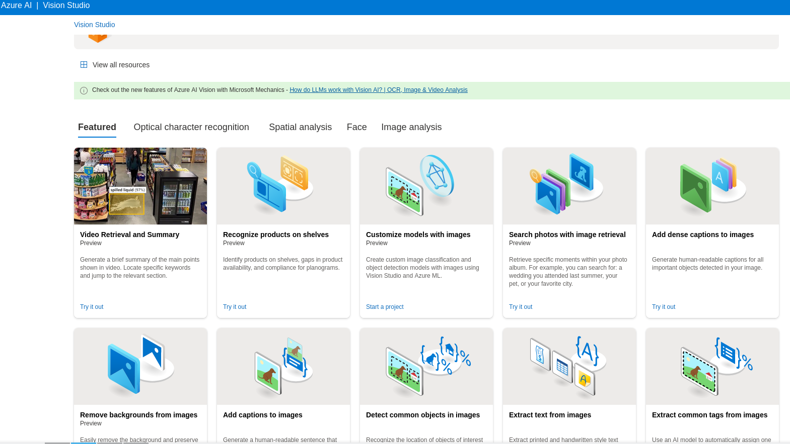

# dio-lab-projFinal
Reconhecimento de texto em imagens

Neste trabalho iremos focar na utilizacao do Azure AI - Visioin Studio, com acesso atraves:

Apos entrar no portal, iremos solucionar o ultimo projeto do Bootcamp Microsoft Azure AI Fundamentals  selecioinando "Extract text from images". Essa API do Azure AI consegue extrair texto a partir de figuras que inserimos atraves de uploads de forma que nao e necessario escrever uma linha de codigo.

Para exemplificar iremos fazer um passo a passo.

## Passo a passo
### Primeira etapa
Criar um criar um Azure AI services resource atraves do portal https://portal.azure.com . Escolhemos um Resource group, caso ja tenha um podemos escolher, e logo depois inserimos um nome deste recurso, que depoiis sera vinculado ao Vision Studio.

### Segunda etapa
Conectar o Azure AI services resource criado anteriormente ao Vision Studio. 

Entrar  https://portal.vision.cognitive.azure.com , seleciionar como default resource o resource que foi criado, e depois clicar em Vision Studio.

### Terceira etapa
Nesta etapa varias features estaram disponiveis para escolher, mas o que faremos e escolher a "Extract Text from Images". A partir de agora sem termos escrito uma linha de comando ja podemos utilizar um recurso de inteligencia artificial para extrair texto de figura, pdf e ate mesmo formato TIFF.

### Resultado
Pegamos alguns arquivos de imagem na net aleatoriamente e retiramos o texto de cada um de forma satisfatoria. Segue abaixo os prints das telas de cada arquivo analisado.

Os resultados dos texto extraidos  podem ser encontrados na pasta output.

## Conclusao
A capacidade de expansao de uma empresa atraves dos pacotes prontos de IA Azure sao de grande valor para uma empresa. Hoje uma empresa sem uma equipe de inteligencia artificial consegue esta podendo concorrer com outras empresas por conta da plataforma AI Azure, onde existem diversas formas dela aplicar inteligencia no negocio dela. Foram feitos alguns exemplos mas de longe nao conseguimos cobrir toda sua capacidade.
